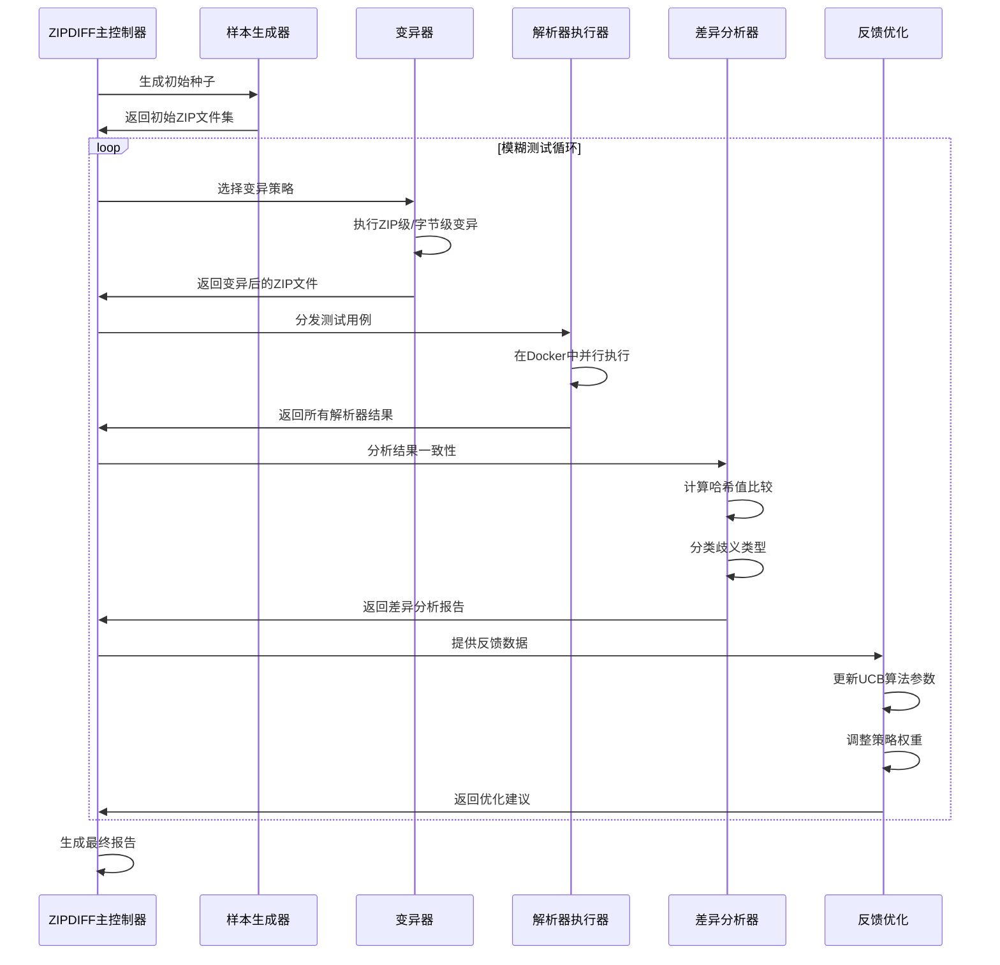

# Stage1: 选题与理解

## 第一周-11.04～11.10

### Target

- 弄清论文研究动机、核心问题与贡献点，搞清楚术语与范围；
- 精读论文摘要/引言/贡献；
- 列出研究问题与应用场景。

#### Detailed

1. 论文到底在解决什么安全问题，为什么重要？说清“ZIP 解析器语义差异”是啥、为什么会被攻击者利用。
2. ZIPDIFF整体流程是怎样的?
3. 如何判断“两个解析器结果不一致”是有意义的，而不是噪声或者是格式差异？
4. 真实影响有哪些场景？
5. 关键名词各是啥？LFH、CDH、EOCDR

#### Deliverables

- 对论文的理解
- 问题清单

### Content

#### 1. 论文到底在解决什么安全问题，为什么重要？说清“ZIP 解析器语义差异”是啥、为什么会被攻击者利用

由于zip文件格式定义存在歧义，定义不够明晰，导致不同实现方式的zip解析器在解析同一个zip文件时会遵循不同的流程、方式，进而产生不同的解析结果。可以理解为zip规范的“方言”，复合标准规范的同时，有着自己的独特实现。这种差异往往是由程序员对zip规范的不同理解、不同实现导致的。

基于上面的原理，攻击者可以利用不同的zip“方言”，构造出一个zip文件，使其在不同的zip解析器中解析出不同的结果。比如文件共享工具使用的A解析器解析出正常文件，但是用户下载到本地后，使用B解析器解压时会解压出恶意文件。

另外，由于绝大多数的应用程序都不会自行实现zip解析器，而是依赖于操作系统或第三方库提供的zip解析器。这就存在供应链攻击的风险。供应链攻击不仅覆盖规模广，而且很难被排查出来。因此，论文的贡献在于发现了zip解析器语义差异这一安全问题，并对主流的解析库、解析器进行了测试，对差异类型进行了分类与评估。

#### 2. ZIPDIFF整体流程是怎样的?



#### 3. 如何判断“两个解析器结果不一致”是有意义的，而不是噪声或者是格式差异？

就目前个人理解来看，只在计算哈希时体现出“区分有意义的差异”，即如下差异会被忽略：

- 包含特殊或无效字符的目录
- 空目录

#### 4. 真实影响有哪些场景？

##### 电子邮件安全检测

可能利用邮件服务器和用户本地的不同解析器实现，使邮件服务器无法检查出恶意文件，而用户本地能解压出恶意文件。

##### Office文档内容伪造

在人工审阅Office文档时，显示抄袭内容。但将文档上传到远程服务器查重时，服务器使用的解析器可能会忽略掉这部分抄袭的内容，导致查重结果错误。

##### LibreOffice文档签名伪造

LibreOffice的签名验证和文档显示尽管使用同一个解析器，但是在恢复模式显示文档时，如果文档损坏，解析器会使用流式模式解读文档，就和签名验证的解析器的行为不一致

##### Spring Boot嵌套JAR签名伪造

将合法的jar包进行修改，插入恶意代码。

在Spring Boot验证jar包签名时，使用流式解析器，会忽略掉插入的恶意代码，导致验证通过。

使用ZipContent对修改后的jar包进行解析，会解析出其中包含的恶意代码。导致Spring Boot应用在运行时，加载并执行了恶意代码，从而引发安全问题。

##### Vscode扩展

Vscode使用命名空间唯一标识每个扩展，防止扩展之间的冲突。但是市场和客户端使用的解析器存在差异。导致发布时验证通过，命名空间唯一，但是在客户端安装时看到另一个命名空间，导致替换用户原有的拓展，从而引发安全问题。

#### 5. 关键名词各是啥？LFH、CDH、EOCDR

Zip文件大致结构如下：


##### LFH：Local File Header（本地文件头）

位于每个压缩文件数据的前方，记录该文件的基本元信息。zip文件中每一个文件和目录都有一个与之对应的本地文件头。

```c
// 本地文件头结构
typedef struct {
    uint32_t signature;            // 0x04034B50
    uint16_t version_needed;       // 解压所需版本
    uint16_t general_bit_flag;     // 通用比特标志
    uint16_t compression_method;   // 压缩方法
    uint16_t last_mod_time;        // 最后修改时间
    uint16_t last_mod_date;        // 最后修改日期
    uint32_t crc32;                // CRC32校验码
    uint32_t compressed_size;      // 压缩后大小
    uint32_t uncompressed_size;    // 未压缩大小
    uint16_t filename_length;      // 文件名长度
    uint16_t extra_field_length;   // 扩展区长度
    char *filename;                // 文件名
    uint8_t *extra_field;          // 扩展区数据
} LocalFileHeader;
```

##### CDH：Central Directory Header（中央目录头）

集中存储所有文件的元数据，通常位于所有文件数据的后面。

```c
// 中央目录文件头结构
typedef struct {
    uint32_t signature;            // 0x02014B50
    uint16_t version_made_by;      // 压缩所用版本
    uint16_t version_needed;       // 解压所需版本
    uint16_t general_bit_flag;     // 通用比特标志
    uint16_t compression_method;   // 压缩方法
    uint16_t last_mod_time;        // 最后修改时间
    uint16_t last_mod_date;        // 最后修改日期
    uint32_t crc32;                // CRC32校验码
    uint32_t compressed_size;      // 压缩后大小
    uint32_t uncompressed_size;    // 未压缩大小
    uint16_t filename_length;      // 文件名长度
    uint16_t extra_field_length;   // 扩展区长度
    uint16_t file_comment_length;  // 文件注释长度
    uint16_t disk_number_start;    // 磁盘起始号
    uint16_t internal_file_attr;   // 内部文件属性
    uint32_t external_file_attr;   // 外部文件属性
    uint32_t local_header_offset;  // 本地文件头偏移
    char *filename;                // 文件名
    uint8_t *extra_field;          // 扩展区数据
    char *file_comment;            // 文件注释
} CentralDirHeader;
```

CDH与LFH的区别在于：CDH提供了zip文件的完整结构信息，为zip提供文件注释、分卷压缩的能力。同时部分字段与LFH存在区别。

| 字段           | LFH            | CDH                      | 差异说明                     |
| -------------- | -------------- | ------------------------ | ---------------------------- |
| 签名字段       | 0x504B0304     | 0x504B0102               | 不同的签名标识不同的结构类型 |
| 版本信息       | 仅包含提取版本 | 包含创建者版本和提取版本 | CDH 提供更完整的版本信息     |
| 文件注释       | 不包含         | 包含文件注释字段         | CDH 支持为每个文件添加注释   |
| 磁盘号信息     | 不包含         | 包含磁盘号和起始磁盘号   | CDH 支持分卷压缩             |
| 文件属性       | 仅包含内部属性 | 包含内部和外部属性       | CDH 提供更完整的文件属性信息 |
| 本地文件头偏移 | 不包含         | 包含指向对应 LFH 的偏移  | CDH 用于定位对应的 LFH       |
| 额外字段       | 支持           | 支持                     | 两者都支持，但内容可能不同   |

##### EOCDR：End of Central Directory Record（中央目录结束记录）

```c
// 中央目录结束记录结构
typedef struct {
    uint32_t signature;            // 0x06054B50
    uint16_t disk_number;          // 磁盘号
    uint16_t disk_dir_start;       // 中央目录起始磁盘号
    uint16_t disk_entries;         // 本磁盘中央目录项数
    uint16_t total_entries;        // 总中央目录项数
    uint32_t dir_size;             // 中央目录大小
    uint32_t dir_offset;           // 中央目录偏移
    uint16_t comment_length;       // 注释长度
    char *comment;                 // 注释内容
} EndCentralDirRecord;
```

### Questions

- 对选题方向有什么建议？
