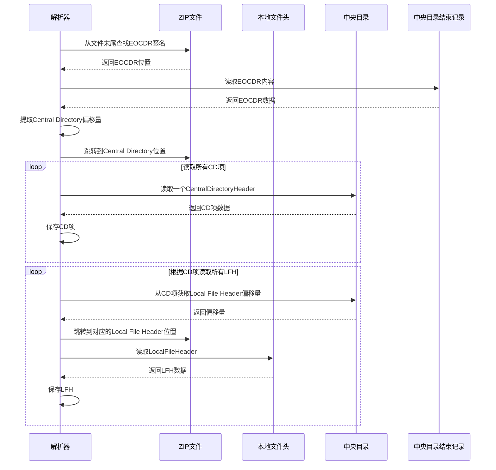
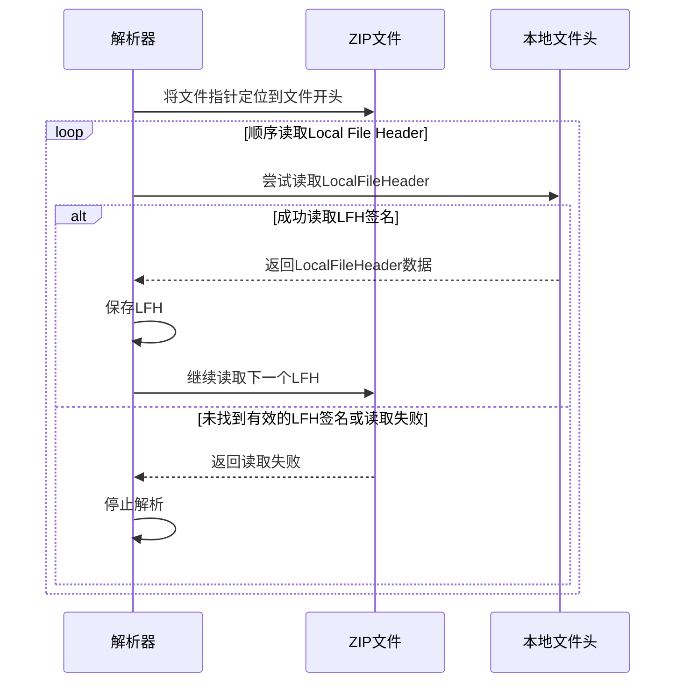
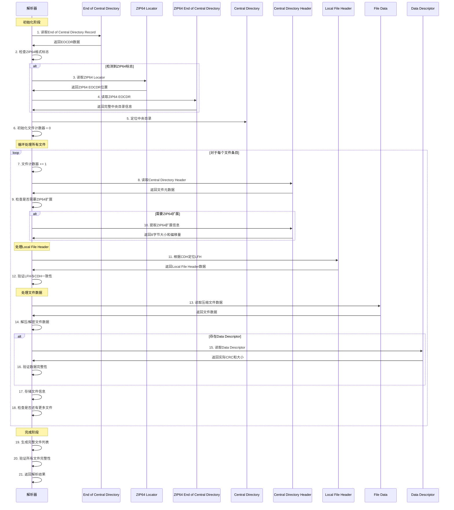
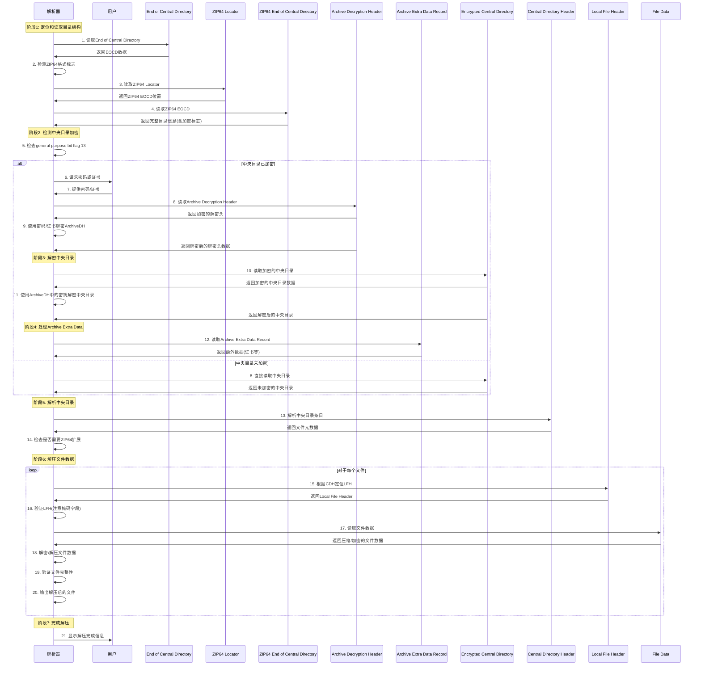
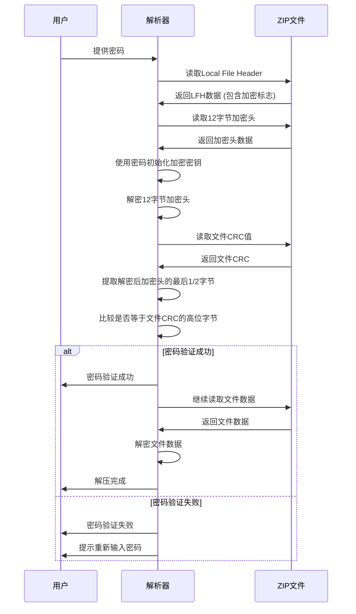
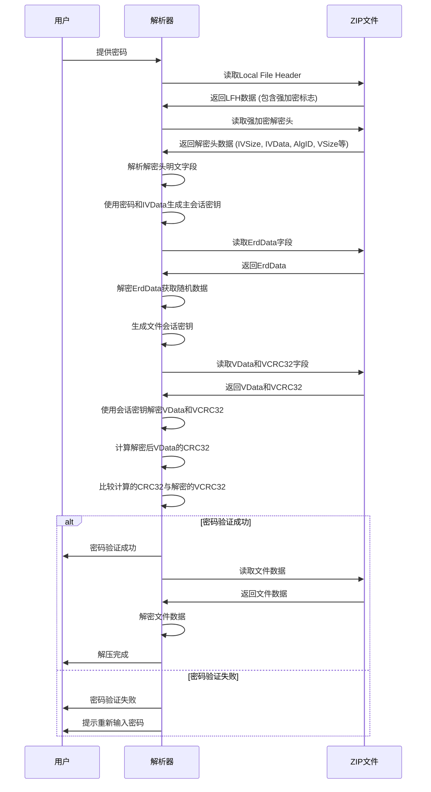
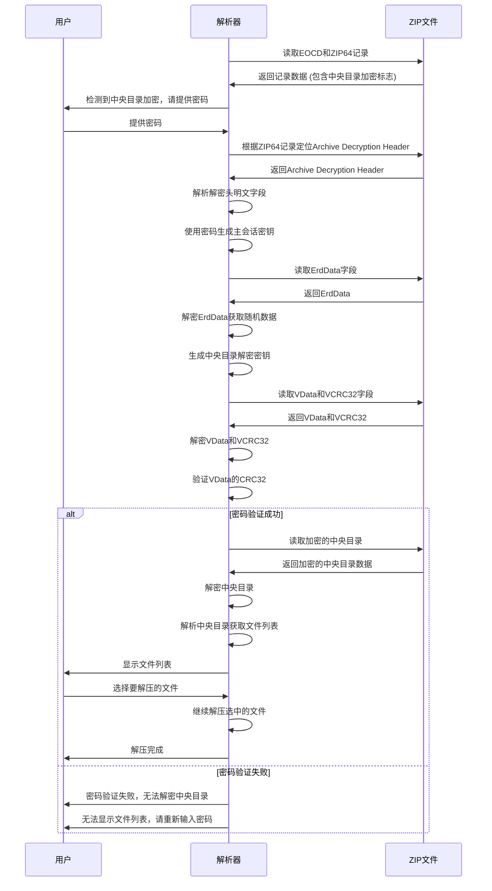

# Stage1 - Week2

## Target

- ZIP基础结构学习，掌握ZIP的结构与解析流程；

### Detailed

1. Zip基础结构，及其解析流程
2. 标准解析模式与流式解析模式的区别
3. Zip进阶结构：加密、Zip64

### Deliverables

- ZIP文件结构图示
- ZIP文件解析流程

## Content

### ZIP文件基础结构图示

具体的结构和解析流程在后面会有详细介绍。


ZIP文件主要由三部分构成:

1. Local File Header: 每个压缩文件的起始位置，包含文件的元数据信息；
2. Central Directory(CD): 压缩文件的目录，记录了所有文件的元数据信息；
3. End of Central Directory(EOCDR): 压缩文件的结束位置，包含目录的元数据信息。

只考虑非分卷压缩的情况，EOCDR中包含指向Central Directory的偏移量，Central Directory的大小，以及CD条目的项数。

中央目录区包含了所有文件的元数据信息，每个文件的元数据信息由一个Central Directory Entry(CD Entry)表示。每个CD项中含有指向对应Local File Header的偏移量。

本地文件头区包含了每个压缩文件的元数据信息，每个文件的元数据信息由一个Local File Header(LFH)表示。文件的实际数据(压缩或未压缩)紧跟在其对应的LFH后面。

### ZIP文件解析流程

本地文件头区已经包含了每个压缩文件的元数据信息，理论上仅通过读取LFH就能解压出压缩包内的所有文件，因此在解析ZIP文件时就产生了两种解析方式。

- 标准解析模式: 先读取整个Central Directory，然后根据CD项中的偏移量，随机访问到对应文件的LFH，从而获取文件的元数据信息。
- 流式解析模式: 从Local File Header开始，顺序解析每个压缩文件的元数据信息，直到无法读取有效的LFH签名为止。

目前大多数ZIP解析器默认采用标准解析模式，忽略掉没有被CD条目指向的LFH。

#### 标准解析模式

从EOCDR中获取指向Central Directory的偏移量，然后根据CD项中的偏移量，随机访问到对应文件的LFH，从而获取文件的元数据信息。



#### 流式解析模式

从Local File Header开始，顺序解析每个压缩文件的元数据信息，直到无法读取有效的LFH签名为止。



### 手工篡改ZIP进行实验

`zip_analyze`目录为一个Zip解析器实例，可以使用两种解析模式读取未加密的Zip文件结构。另外该目录下包含两个Zip文件，分别为`zip_demo.zip`和`zip_demo_hacked.zip`。两者的区别在于`zip_demo_hacked.zip`在`zip_demo.zip`的基础上，在LFH区添加了一个额外的文件`hacked.txt`对应的LFH及其数据。具体如下图所示：


使用`zip_analyze`解析`zip_demo_hacked.zip`文件，在标准解析模式下，`zip_analyze`忽略掉了仅在LFH中存在的`hacked.txt`文件；而在流式解析模式下，`zip_analyze`能够成功解析出`hacked.txt`文件的信息。

### Zip文件具体分析

根据[官方文档](https://pkware.cachefly.net/webdocs/casestudies/ParserNOTE.TXT), Zip文件的结构如下:

```plaintext
[local file header 1]
[encryption header 1]
[file data 1]
[data descriptor 1]
.
.
.
[local file header n]
[encryption header n]
[file data n]
[data descriptor n]
[archive decryption header]
[archive extra data record]
[central directory header 1]
.
.
.
[central directory header n]
[zip64 end of central directory record]
[zip64 end of central directory locator]
[end of central directory record]
```


#### 本地文件头 - Local File Header

```cpp
    uint32_t signature;
    uint16_t version_needed;
    uint16_t general_bit_flag;
    uint16_t compression_method;
    uint16_t last_mod_time;
    uint16_t last_mod_date;
    uint32_t crc32;
    uint32_t compressed_size;
    uint32_t uncompressed_size;
    uint16_t filename_length;
    uint16_t extra_field_length;
    std::string filename;
    std::unique_ptr<uint8_t[]> extra_field;
```

本地文件头的extra_field没有固定的内容，不同的压缩器可能会在extra_field中添加不同的信息。但是在extra_field中添加信息时通常要遵循统一的结构: 标签 - 长度 - 数据。

- Tag（2 字节）：标识该扩展块的类型（如操作系统相关信息、压缩算法扩展等）。
- Length（2 字节）：表示后续数据的长度。
- Data：具体的扩展数据，格式由 Tag 定义。

具体标签值和含义的映射可以参考官方文档的4.5.2节，其中列举了由PKWARE定义的标签值和含义。

##### general_bit_flag

#### 加密头 - Encryption Header

是否存在: 仅当`general_bit_flag`的第0位为1时，才存在加密头。

加密头的具体长度与结构由`general_bit_flag`的第6位确定：

- 当第六位为0时，加密头格式为传统PKWARE加密格式，长度为12字节；
- 当第六位为1时，加密头格式强加密格式，长度为可变，至少30字节。

```plaintext
IVSize    2 bytes  - 初始化向量大小
IVData    IVSize   - 初始化向量数据
Size      4 bytes  - 剩余解密头数据大小
Format    2 bytes  - 格式定义 (当前必须为3)
AlgID     2 bytes  - 加密算法标识符
Bitlen    2 bytes  - 密钥长度 (32-448 bits)
Flags     2 bytes  - 处理标志
ErdSize   2 bytes  - 加密随机数据大小
ErdData   ErdSize  - 加密的随机数据
Reserved1 4 bytes  - 证书处理保留字段
Reserved2 (var)    - 证书处理保留字段
VSize     2 bytes  - 密码验证数据大小
VData     VSize-4  - 密码验证数据 (加密)
VCRC32    4 bytes  - 密码验证数据的CRC32 (加密)
```

校验密码是否正确即是通过加密头内的部分字段进行的。

#### 数据描述符 - Data Descriptor

用于在流式压缩场景下，将压缩数据的CRC-32、压缩大小和未压缩大小等信息从文件数据中分离出来。

由于lfh在文件数据之前，因此在流式压缩场景下，无法提前确定lfh中的crc32, compressed_size和uncompressed_size字段。此时，需要在文件数据之后添加一个数据描述符，用于存储这些信息。

```cpp
    uint32_t signature;             /* 0x08074b50 */
    uint32_t crc32;
    uint32_t compressed_size;
    uint32_t uncompressed_size;
```

#### 归档解密头 - Archive Decryption Header

结构与加密头相同，不同的是加密头是在每个文件数据之前，而归档解密头是在所有文件数据之后。归档解密头的位置由Zip64 End of Central Directory Record中的Start of Central Directory字段指定。

使用归档解密头可以支持加密整个中央目录结构，保护所有文件的元数据。

只在Zip64格式下才会存在归档解密头。

归档解密头的结构与Encryption Header完全相同。

#### 归档额外数据记录 - Archive Extra Data Record

Archive Extra Data Record 主要用于存储与中央目录加密相关的额外信息，特别是：

- 数字证书信息：存储 PKCS#7 证书存储、X.509 证书 ID 和签名等
- 加密相关数据：存储加密接收者证书列表等

其结构定义如下：

```cpp
    uint32_t signature;             /* 0x08074b50 */
    uint32_t extra_field_length;
    std::unique_ptr<uint8_t[]> extra_field;
```

#### 中央目录头 - Central Directory Header

```cpp
    uint32_t signature;
    uint16_t version_made_by;
    uint16_t version_needed;
    uint16_t general_bit_flag;
    uint16_t compression_method;
    uint16_t last_mod_time;
    uint16_t last_mod_date;
    uint32_t crc32;
    uint32_t compressed_size;
    uint32_t uncompressed_size;
    uint16_t filename_length;
    uint16_t extra_field_length;
    uint16_t file_comment_length;
    uint16_t disk_number_start;
    uint16_t internal_attr;
    uint32_t external_attr;
    uint32_t local_header_offset;
    std::string filename;
    std::unique_ptr<uint8_t[]> extra_field;
    std::string file_comment;
```

中央目录头与本地文件头之间存在许多冗余字段，原则上相对应的一对中央目录头和本地文件头，表示含义相同的字段值应该是相同的。

### 相关流程

#### Zip64解析流程



#### 启用中央目录加密时的解析流程



#### 校验密码是否正确

##### 传统PKWARE加密格式校验密码



##### 强加密



##### 启用中央目录加密



## Questions

- 考虑加密和Zip64的情况下，Zip文件结构会复杂很多，在后续工作中需要偏向考虑这两种case嘛？
- 标准解析模式下，从文件尾部搜索EOCDR时，如果EOCDR中的extra field中如果出现一个完整的EOCDR，解析器会如何处理？
