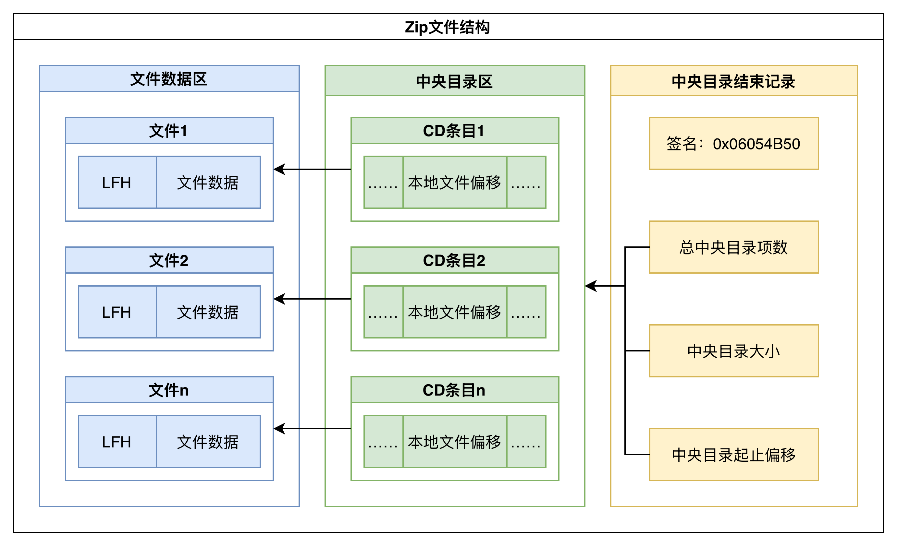

# Stage1 - Week2

## Target

- ZIP基础结构学习，掌握ZIP的结构与解析流程；

### Detailed

1. 

### Deliverables

- ZIP文件结构图示
- ZIP文件解析流程

## Content

### ZIP文件结构图示

ZIP文件主要由三部分构成:

1. Local File Header: 每个压缩文件的起始位置，包含文件的元数据信息；
2. Central Directory(CD): 压缩文件的目录，记录了所有文件的元数据信息；
3. End of Central Directory(EOCDR): 压缩文件的结束位置，包含目录的元数据信息。

只考虑非分卷压缩的情况，EOCDR中包含指向Central Directory的偏移量，Central Directory的大小，以及CD条目的项数。

中央目录区包含了所有文件的元数据信息，每个文件的元数据信息由一个Central Directory Entry(CD Entry)表示。每个CD项中含有指向对应Local File Header的偏移量。

本地文件头区包含了每个压缩文件的元数据信息，每个文件的元数据信息由一个Local File Header(LFH)表示。文件的实际数据(压缩或未压缩)紧跟在其对应的LFH后面。

### ZIP文件解析流程

本地文件头区已经包含了每个压缩文件的元数据信息，因此在解析ZIP文件时就产生了两种解析方式。

- 标准解析模式: 从EOCDR中获取指向Central Directory的偏移量，然后根据CD项中的偏移量，随机访问到对应文件的LFH，从而获取文件的元数据信息。
- 流式解析模式: 从Local File Header开始，顺序解析每个压缩文件的元数据信息，直到解析到EOCDR。
