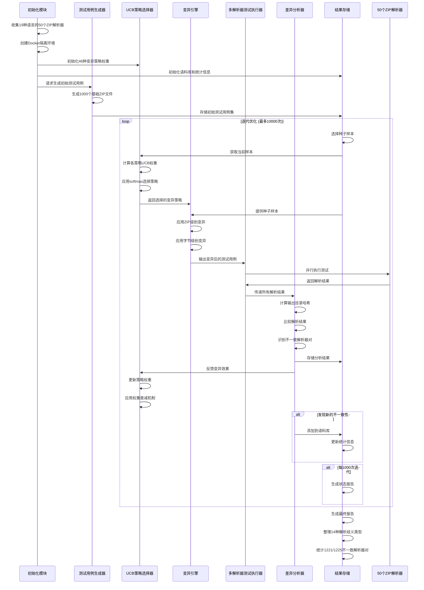
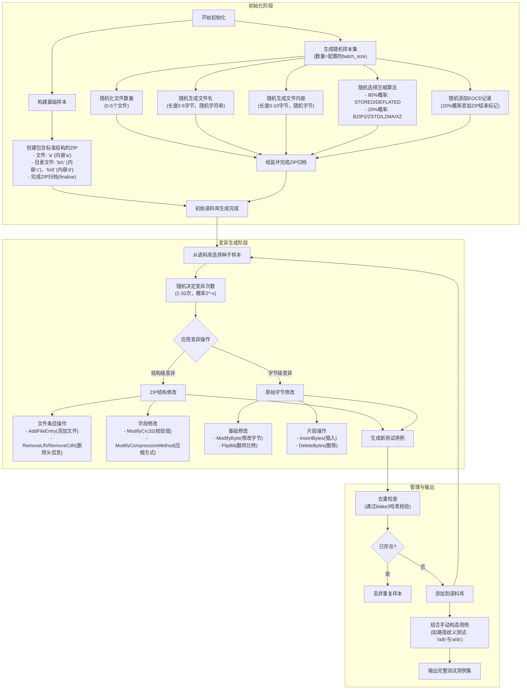

# Stage1-Week3

## Target

通读方法与实验部分，整理技术路线（差异检测→样本生成→多解析器对比）

### Detailed

- 学习理解ZIPDIFF的工作流程；

### Deliverables

详细的技术路线图 + 文字解释 + 讲解

## Content

### 工作流程概览

### 工作流程详细解释

#### 测试用例生成器

## Questions
